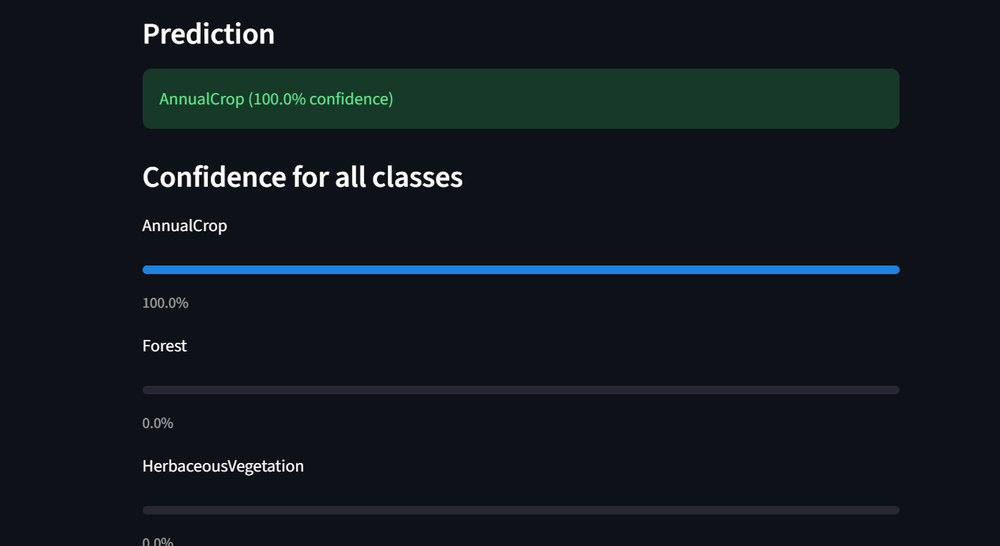
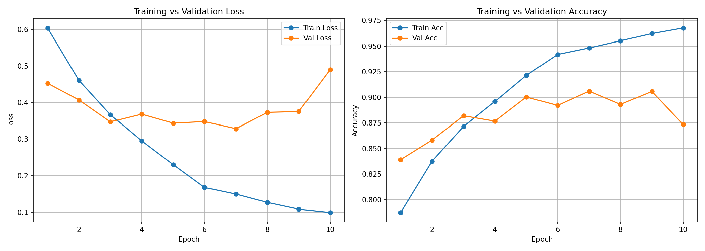
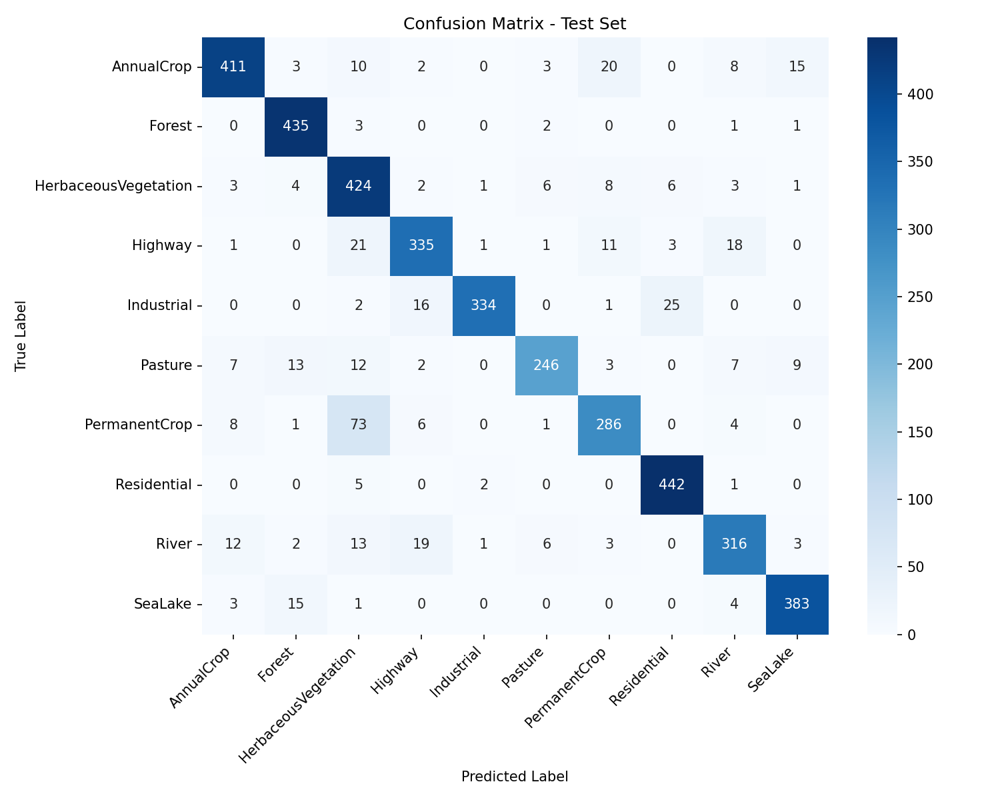

# Satellite Image Analysis with AI

A deep learning web application that classifies satellite images into 10 land-use categories using a custom-built Convolutional Neural Network (CNN), trained from scratch on the EuroSAT dataset.

## Overview

This project takes a satellite image as input and predicts its land-use type (Forest, Residential, Highway, River, etc.) along with a confidence score, using a CNN built and trained from scratch in PyTorch, no pretrained models. It includes a full ML pipeline: data preprocessing, model training with checkpointing, evaluation, and a live Streamlit web interface.

## Features

- Upload any satellite image (JPG/PNG) through a web interface
- Classifies into 10 land-use categories: AnnualCrop, Forest, HerbaceousVegetation, Highway, Industrial, Pasture, PermanentCrop, Residential, River, SeaLake
- Displays prediction confidence for all classes, not just the top result
- Custom CNN trained from scratch (3 conv blocks, approximately 96.8% training accuracy, 89.19% test accuracy)
- Full evaluation suite: training curves, confusion matrix, per-class precision/recall/F1

## Tech Stack

- PyTorch: model architecture, training, inference
- OpenCV: image preprocessing (resizing, color handling)
- Streamlit: web application interface
- scikit-learn: evaluation metrics (confusion matrix, classification report)
- Google Colab (T4 GPU): model training

## Dataset

EuroSAT: 27,000 labeled Sentinel-2 satellite images (64x64 RGB) across 10 land-use classes. Downloaded automatically via torchvision.datasets.EuroSAT.

## Project Structure

satellite-image-analysis/
- app/ : Streamlit web application (app.py)
- src/ : core source code (dataset.py, model.py, utils.py, download_data.py)
- models/ : trained model weights (satellite_cnn.pth)
- notebooks/ : data exploration
- outputs/plots/ : training curves, confusion matrix
- requirements.txt

## Setup and Usage

1. Clone the repository:
   git clone https://github.com/jayvankar/satellite-image-analysis.git
   cd satellite-image-analysis

2. Create a virtual environment and install dependencies:
   python -m venv venv
   venv\Scripts\activate
   pip install -r requirements.txt

3. Run the app (uses the pre-trained model included in this repo):
   python -m streamlit run app/app.py

4. Optional, to retrain the model yourself:
   python src/download_data.py
   then run the training notebook/script, see notebooks/

## Results

Test Accuracy: 89.19% (on 4,050 unseen images)

| Metric | Score |
|---|---|
| Train Accuracy | 96.03% (best checkpoint, epoch 6) |
| Validation Accuracy | 89.80% (best checkpoint, epoch 6) |
| Test Accuracy | 89.19% |

### Training Curves

### Confusion Matrix

## Key Learnings and Limitations

- Overfitting was observed and addressed: training accuracy continued climbing to 96%+ while validation accuracy peaked at epoch 6 and declined afterward. Fixed using checkpointing, saving only the best-validation-accuracy model rather than the final epoch weights.
- Model's main weakness: PermanentCrop is frequently confused with HerbaceousVegetation (73 out of 379 test images), likely due to visual similarity between dense perennial crops and natural vegetation at 64x64 resolution.
- Strongest classes: Forest (98% recall) and Residential (98% recall), both have highly distinctive visual signatures.

## Future Improvements

- Data augmentation (rotation, flips) to reduce overfitting further
- Transfer learning comparison (e.g., ResNet) against this from-scratch CNN
- Using EuroSAT full 13-band multispectral data instead of RGB-only
- Higher resolution input images to help distinguish visually similar crop types

## License

This project is open source under the MIT License. EuroSAT dataset is provided by its original authors for research and educational use.
